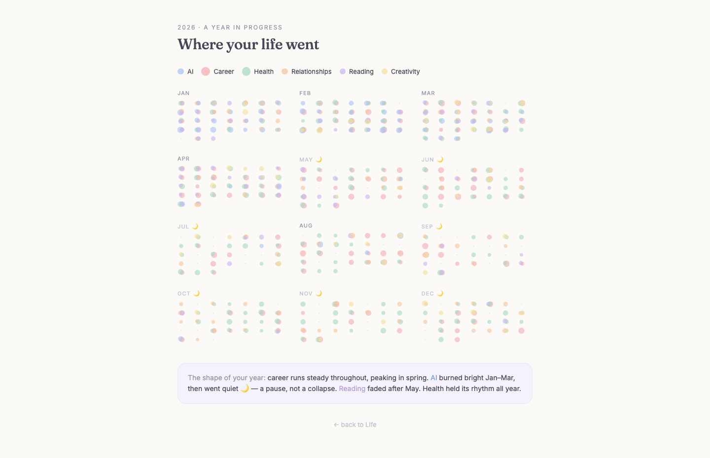

# Life OS

A visual operating system for a life — organized by **purpose**, not time.

Not a calendar app, habit tracker, task manager, or journal. The calendar is one visualization; **goals are the foundation**. Every design decision answers one question:

> Does this help the user understand who they are becoming?



## Run

```bash
npm install
npm run dev
```

Home (`/`) opens into Life. Calendar (`/year`) shows the year as history.

## Read first

1. `CLAUDE.md` — how to work in this repo + non-negotiables
2. `docs/philosophy.md` — the full spec
3. `docs/design-system.md` — palette, type, motion
4. `docs/architecture.md` — data model direction
5. `docs/roadmap.md` — what's done, what's next

## Status

Prototype: home + year screens on mock data. Next big thing is the Google-Maps-style zoom (`docs/roadmap.md`).

## Stack

Vite · React 18 · react-router-dom · inline styles + design tokens. No CSS framework.
